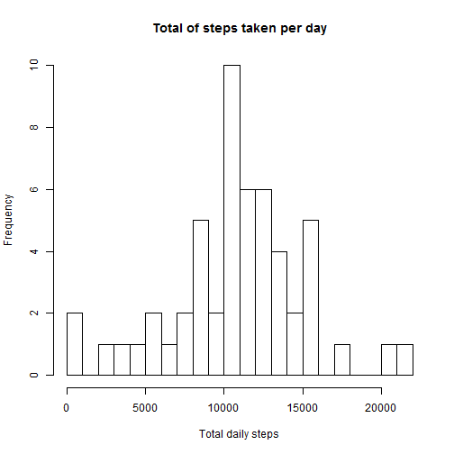
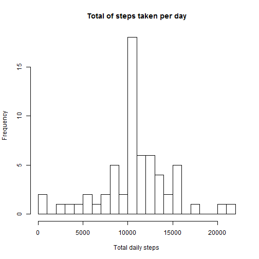
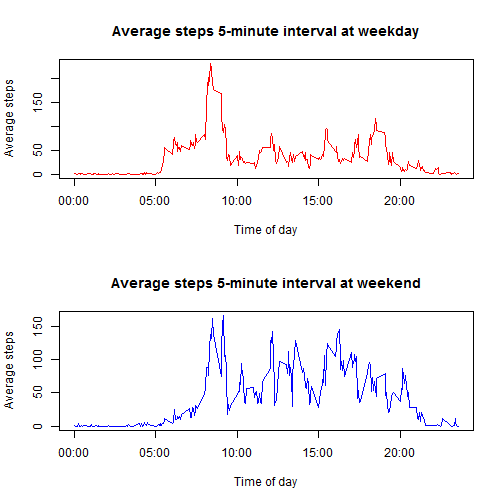
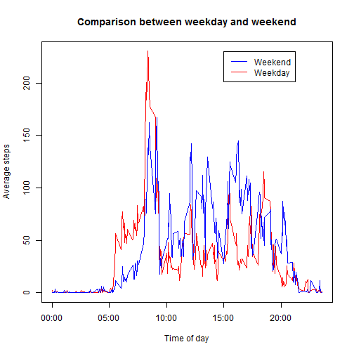

## Loading and preprocessing the data

```r
library(knitr)
opts_chunk$set(echo=TRUE, cache=TRUE)
data <- read.csv(unz("activity.zip", "activity.csv"))
```


## What is mean total number of steps taken per day?

```r
hist(tapply(data$steps, data$date, sum), xlab = "Total daily steps", breaks = 20, 
     main = "Total of steps taken per day")
```

 

```r
total.daily.steps <- as.numeric(tapply(data$steps, data$date, sum))
step.mean <- mean(total.daily.steps, na.rm = TRUE)
step.median <- median(total.daily.steps, na.rm = TRUE)
step.mean
```

```
## [1] 10766.19
```

```r
step.median
```

```
## [1] 10765
```


## What is the average daily activity pattern?

```r
data$interval <- as.factor(as.character(data$interval))
interval.mean <- as.numeric(tapply(data$steps, data$interval, mean, na.rm = TRUE))
intervals <- data.frame(intervals = as.numeric(levels(data$interval)), interval.mean)
intervals <- intervals[order(intervals$intervals), ]

labels <- c("00:00", "05:00", "10:00", "15:00", "20:00")
labels.at <- seq(0, 2000, 500)
plot(intervals$intervals, intervals$interval.mean, type = "l", main = "Average steps 5-minute interval", 
     ylab = "Average steps", xlab = "Time of day", xaxt = "n")
axis(side = 1, at = labels.at, labels = labels)
```

 

Which 5-minute interval, on average across all the days in the dataset, contains the maximum number of steps?
The interval with the maxium number of steps across all days is

```r
intervals.sorted <- intervals[order(intervals$interval.mean, decreasing = TRUE),]
head(intervals.sorted)
```

```
##     intervals interval.mean
## 272       835      206.1698
## 273       840      195.9245
## 275       850      183.3962
## 274       845      179.5660
## 271       830      177.3019
## 269       820      171.1509
```

```r
max.interval <- intervals.sorted$intervals[1[1]]
max.interval
```

```
## [1] 835
```


## Imputing missing values

There are many days/intervals where there are missing values (coded as `NA`). The presence of missing days may introduce bias into some calculations or summaries of the data.


```r
dim(data[is.na(data$steps), ])[1]
```

```
## [1] 2304
```
The total number of missing values in the dataset (i.e. the total number of rows with NAs) is 2304.
The strategy for filling in all of the missing values in the dataset is to change the ¡§NA"s to the mean values for that 5-minute interval.


```r
steps <- vector()
for (i in 1:dim(data)[1]) {
  if (is.na(data$steps[i])) {
    steps <- c(steps, intervals$interval.mean[intervals$intervals == data$interval[i]])
  } else {
    steps <- c(steps, data$steps[i])
  }
}

activity.without.missing.data <- data.frame(steps = steps, date = data$date, 
                                            interval = data$interval)
hist(tapply(activity.without.missing.data$steps, activity.without.missing.data$date, 
            sum), xlab = "Total daily steps", breaks = 20, main = "Total of steps taken per day")
```

 

Mean and median values are higher after imputing missing data. The reason is
that in the original data, there are some days with `steps` values `NA` for 
any `interval`. The total number of steps taken in such days are set to 0s by
default. However, after replacing missing `steps` values with the mean `steps`
of associated `interval` value, these 0 values are removed from the histogram
of total number of steps taken each day.


```r
total.daily.steps <- as.numeric(tapply(activity.without.missing.data$steps, 
                                       activity.without.missing.data$date, sum))
step.mean <- mean(total.daily.steps)
step.median <- median(total.daily.steps)
step.mean
```

```
## [1] 10766.19
```

## Are there differences in activity patterns between weekdays and weekends?

First, let's find the day of the week for each measurement in the dataset. In
this part, we use the dataset with the filled-in values.


```r
activity.without.missing.data$day.type <- c("weekend", "weekday", "weekday", 
                                            "weekday", "weekday", "weekday", "weekend")[as.POSIXlt(activity.without.missing.data$date)$wday + 
                                                                                          1]
activity.without.missing.data$day.type <- as.factor(activity.without.missing.data$day.type)

weekday <- activity.without.missing.data[activity.without.missing.data$day.type == 
                                           "weekday", ]
weekend <- activity.without.missing.data[activity.without.missing.data$day.type == 
                                           "weekend", ]
weekday.means <- as.numeric(tapply(weekday$steps, weekday$interval, mean))
weekend.means <- as.numeric(tapply(weekend$steps, weekend$interval, mean))

intervals.day.type <- data.frame(intervals = as.numeric(levels(data$interval)), 
                                 weekday.means, weekend.means)
intervals.day.type <- intervals.day.type[order(intervals.day.type$intervals),]
```

Now, let's make a panel plot containing plots of average number of steps taken
on weekdays and weekends.


```r
par <- par(mfrow = c(2, 1))
plot(intervals.day.type$intervals, intervals.day.type$weekday.means, type = "l", 
     col = "red", ylab = "Average steps", xlab = "Time of day", main = "Average steps 5-minute interval at weekday", 
     xaxt = "n")
axis(side = 1, at = labels.at, labels = labels)
plot(intervals.day.type$intervals, intervals.day.type$weekend.means, type = "l", 
     col = "blue", ylab = "Average steps", xlab = "Time of day", main = "Average steps 5-minute interval at weekend", 
     xaxt = "n")
axis(side = 1, at = labels.at, labels = labels)
```

 

```r
par(par)
##It is a bit difficult to compare the two plots. For a better comparison, combine the time series on a single plot.
plot(intervals.day.type$intervals, intervals.day.type$weekday.means, type = "l", 
     col = "red", ylab = "Average steps", xlab = "Time of day", main = "Comparison between weekday and weekend", 
     xaxt = "n")
axis(side = 1, at = labels.at, labels = labels)
lines(intervals.day.type$intervals, intervals.day.type$weekend.means, type = "l", 
      col = "blue")
legend(1500, 230, c("Weekend", "Weekday "), lty = c(1, 1), lwd = c(1, 1), col = c("blue", 
                                                                                  "red"))
```

 
