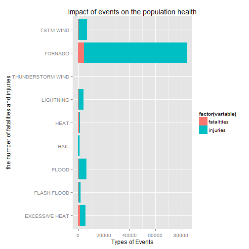
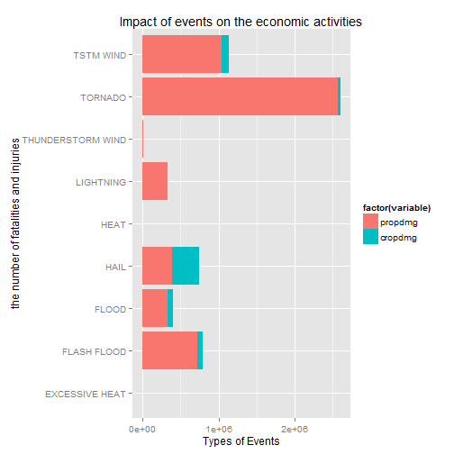

Exploring the U.S. National Oceanic and Atmospheric Administration¡¦s (NOAA) storm database
==========================================
#Title: Analysis of US Storm Data for Reproducible Data Peer Assessment 2
## Impact of Severe Weather Events on Public Health and Economy in the United States

### Synonpsis  
In this report, we aim to analyze the impact of different weather events on public health and economy based on the storm database collected from the U.S. National Oceanic and Atmospheric Administration's (NOAA) from 1950 - 2011. We will use the estimates of fatalities, injuries, property and crop damage to decide which types of event are most harmful to the population health and economy. From these data, we found that excessive heat and tornado are most harmful with respect to population health, while flood, drought, and hurricane/typhoon have the greatest economic consequences.

### Basic settings

```r
library(knitr)
library(plyr)
library(ggplot2)
library(reshape)
library(ddply)
```

```
## Error in library(ddply): there is no package called 'ddply'
```

```r
library(plyr)
```

### Data Processing

Data Loading
To begin processing the data, let¡¦s first download the csv.bz2 file, being sure to use http, instead of https in the file URL. Also, let¡¦s set cache = TRUE in the .Rmd code chunk, so we can avoid downloading the 46.8MB file everytime we knit the .Rmd!

The events in the database start in the year 1950 and end in November 2011.
In the earlier years of the database there are generally fewer events recorded, most likely due to a lack of good records.
More recent years should be considered more complete.

By using melt function we get the data set is summarised by each type of events. For the population health, columns ¡§FATALITIES¡¨ and ¡§INJURIES¡¨ look to be relevant, and thus to be included in the analysis. For the economic damages, both PROPDMG (the property damage) and CROPDMG (the crop damage) are used.


```r
data <- read.table("repdata-data-StormData.csv",  header = TRUE, quote="\"", sep=",", nrows=540000, fill = TRUE, na.strings="0")

#Look at the dimensions of your data frame and the column of the classes
#dim(data)
#lapply(data, class)
#str(data)

#mycol <- c("EVTYPE", "FATALITIES", "INJURIES", "PROPDMG", "PROPDMGEXP", "CROPDMG", "CROPDMGEXP")
#mydata <- data[mycol]
#unique(mydata$PROPDMGEXP)

data.evtype <- ddply(data, .(EVTYPE), summarize, 
                     fatalities=sum(FATALITIES), injuries=sum(INJURIES), 
                     total_health_harm = sum(FATALITIES+INJURIES),
                     propdmg = sum(PROPDMG), cropdmg=sum(CROPDMG),
                     total_economic_dmg = sum(PROPDMG+CROPDMG) )
head(data.evtype, 3)
```

```
##                  EVTYPE fatalities injuries total_health_harm propdmg
## 1    HIGH SURF ADVISORY          0        0                 0     200
## 2         COASTAL FLOOD          0        0                 0       0
## 3           FLASH FLOOD          0        0                 0      50
##   cropdmg total_economic_dmg
## 1       0                200
## 2       0                  0
## 3       0                 50
```

#### Transforming ¡§EVTYPE¡¨ and arrange in desc order to find out summary of FATALITIES and INJURIES
EVTYPE is the variable we analyze to decide which column to be used and orderd.
The worst 5 events that have impacts on the population health can be checked by looking at the sum of FATALITIES and INJURIES.

```r
data.evtype <- arrange(data.evtype, desc(total_health_harm), desc(fatalities), desc(injuries))
head(data.evtype, n=5)
```

```
##           EVTYPE fatalities injuries total_health_harm   propdmg  cropdmg
## 1        TORNADO       4649    80007             84656 2560108.6 36540.42
## 2      TSTM WIND        465     6360              6825 1040812.2 93446.65
## 3          FLOOD        257     6499              6756  337232.8 60768.71
## 4 EXCESSIVE HEAT       1415     4280              5695      53.8     2.00
## 5      LIGHTNING        560     3606              4166  331969.2  2411.61
##   total_economic_dmg
## 1          2596649.0
## 2          1134258.8
## 3           398001.6
## 4               55.8
## 5           334380.9
```

#### Results
We will convert the **property damage** and **crop damage** data into comparable numerical forms according to the meaning of units described in the code book ([Storm Events](http://ire.org/nicar/database-library/databases/storm-events/)). Both `PROPDMGEXP` and `CROPDMGEXP` columns record a multiplier for each observation, events most harmful to population health.


```r
data.melt <- melt(subset(data.evtype, select=-c(total_health_harm,total_economic_dmg)), id.vars=c("EVTYPE"), variable.name="dmg_type", na.rm=TRUE)
m1 <- ggplot(subset(data.melt, EVTYPE %in% c("EXCESSIVE HEAT","HEAT", "LIGHTNING","HAIL","TORNADO","FLASH FLOOD","TSTM WIND","FLOOD","THUNDERSTORM WIND") & variable %in% c("injuries","fatalities")), aes(x=EVTYPE, y=value, fill=factor(variable)))
m1 <- m1 + geom_bar(stat="identity" )+coord_flip()
m1 + xlab("the number of fatalities and injuries") + ylab("Types of Events") + ggtitle("Impact of events on the population health")
```

 

```r
#print(m1)
```

### Events with the greatest economic impact
For the economic impact, we can use a similar code:

```r
data.evtype <- arrange(data.evtype, desc(total_economic_dmg), desc(propdmg), desc(cropdmg))
head(data.evtype, n=5)
```

```
##               EVTYPE fatalities injuries total_health_harm   propdmg
## 1            TORNADO       4649    80007             84656 2560108.6
## 2          TSTM WIND        465     6360              6825 1040812.2
## 3        FLASH FLOOD        556     1404              1960  724335.5
## 4               HAIL         12     1152              1164  388647.9
## 5 THUNDERSTORM WINDS         64      908               972  446293.2
##     cropdmg total_economic_dmg
## 1  36540.42          2596649.0
## 2  93446.65          1134258.8
## 3  73534.49           797870.0
## 4 355193.32           743841.2
## 5  18684.93           464978.1
```

The tornado has the highest damage, then Flash flood, TSTM wind, hail and flood follow. It is reasonable because events that have serious damages on the population health would also have adverse impact on the economic activity. 

```r
m2 <- ggplot(subset(data.melt, EVTYPE %in% c("EXCESSIVE HEAT","HEAT", "LIGHTNING","HAIL","TORNADO","FLASH FLOOD","TSTM WIND","FLOOD","THUNDERSTORM WIND") & 
                      variable %in% c("propdmg","cropdmg")),
             aes(x=EVTYPE, y=value, fill=factor(variable)))
m2 <- m2 + geom_bar(stat="identity" )+coord_flip()
m2 + xlab("the number of fatalities and injuries") + ylab("Types of Events") + 
  ggtitle("Impact of events on the economic activities")
```

 

```r
#print(m2)
```

The property damage tends to be much higher than the crop damage for the other events but hail. Tornadoes are the most dangerous to people but storm surges, hurricanes, and floods are most costly. Also, flooding is the most costly, but heat and tornadoes injure or kill more people..
